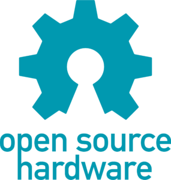
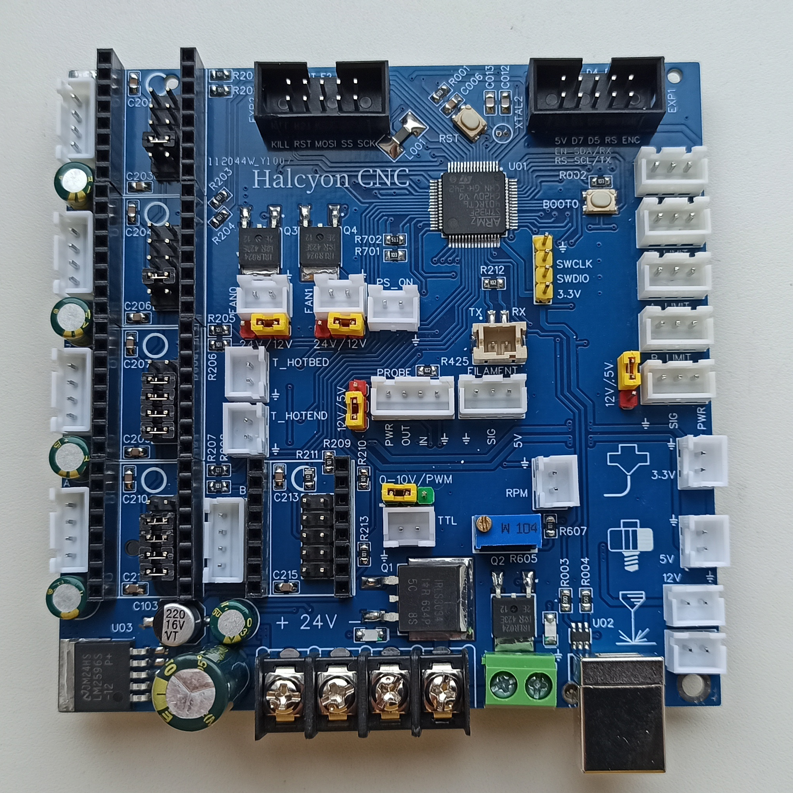
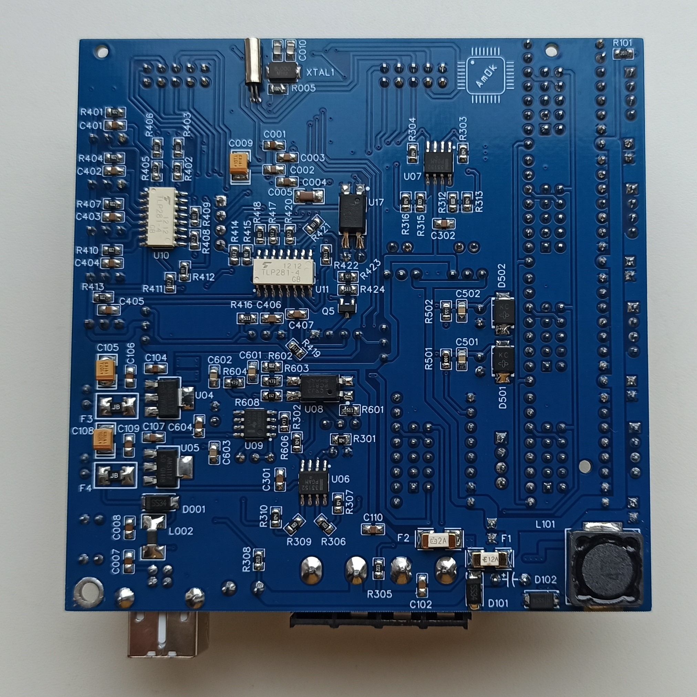

  
  
  
  
  

<h1 align="center">Halcyon CNC board</h1>

Проект открытой управляющей платы ЧПУ на основе МК STM32F401RCT6. Разработана для работы под управление прошивок Marlin и GRBL.

## Marlin 2.1.2.1

Плата поддерживает и протестированна с прошивкой на базе Marlin 2.1.2.1. 
В репозитории вы можете найти пример исходников модифицированной прошивки с уже добавленной поддержкой платы, 
а так же инструкцию по модицикации оригинальных исходников <a href="https://github.com/MarlinFirmware/Marlin">Marlin</a>. 
Для компиляции использовался <a href="https://code.visualstudio.com">Visual Studio Code</a> с 
установленным PlatformIO, перед сборкой выбираем окружение `env:Halcyon_v1_dfu` для прошивки по DFU, `env:Halcyon_v1_stlink`
для прошивки с помощью ST-LINK.

## GRBL 1.1f.

Плата официально добавлена в прошивку <a href="https://github.com/grblHAL/STM32F4xx">GRBL HAL Driver</a>. 
В репозитории вы можете найти пример исходников прошивки под самосборную 4-осевую кинематику (3 осевой фрезер + поворотная ось),
а так же инструкцию по некоторой модицикации оригинальных исходников.
Для компиляции использовался <a href="https://code.visualstudio.com">Visual Studio Code</a> с 
установленным PlatformIO, перед сборкой выбираем окружение `env:Halcyon_v1_dfu` для прошивки по DFU, `env:Halcyon_v1_stlink`
для прошивки с помощью ST-LINK.

## Дополнительное ПО.

Так же вам могут быть полезны следующие программы для заливки прошивки по DFU:
 * <a href="https://www.st.com/en/development-tools/stsw-stm32080.html">DfuSe USB device firmware upgrade</a>
 * <a href="https://www.st.com/en/development-tools/stm32cubeprog.html">STM32 Cube Programmer</a>

## Внешний вид.

  
  

## Особенности.

  

Плата построена на базе современного и дешевого 32-битного МК STM32F401RCT6.

- Питание платы осуществляется от блока питания 24 В, никаких дополнительных линий питания не требуется.

- Возможность подключения до 5 независимых осей. Реализовано управление драйверами ШД через UART.

 

Для конфигурирования работы драйверов в режиме Standalone или UART, а так же настройки микрошага, установите
соответствующие перемычки.

|  | Для конфигурирования работы драйверов в режиме Standalone или UART, а так же настройки микрошага, установите соответствующие перемычки. |

- Питание нагревателя экструдера осуществляется напряжением первичного питания.

- Для подключения нагревателя стола или шпинделя на плате необходимо установить перемычку,
выбрав один из вариантов: `0-10V` для подключения шпинделей, управляемых внешним драйвером с возможностью задавать
обороты аналоговым сигналом `RPM`, снимаемым с соответствующего разъема на плате (подстройка верхнего предела возможна
потенциометром `R605`), либо `PWM`, если необходимо управление сигналом `TTL` с соответствующего разъема (для лазеров
или SSR, через которых подключен нагреватель стола). Так же при установленной перемычке `RPM` возможно подключение
через встроенный силовой мосфет (для 24В нагревателей или коллекторных шпинделей с током потребления до 12А).

- 2 управляемых вентилятора с возможностью выбора напряжения питания для каждого из них.

- 5 независимых концевых выключателей, имеющих опторазвязку. Напряжение питание концевых выключателей может быть выбрано.
Плата рассчитана на работу с концевыми выключателями, в которых общий (COM) сигнальный контакт нормально-замкнут на землю и при срабатывании 
коммутируется с напряжением питания. При таком способе подключения выключатель "срабатывает" так же в случае его обрыва или отсоединения от платы. 
Также может быть использован индуктивный выключатель NPN с нормально замкнутым контактом LJ12A3-4-ZAX.

- Разъем `PROBE` для подключения датчиков автоуровня / длины инструмента (с опторазвязкой входного и выходного сигнала).

- Разъем `FILAMENT` для подключения датчика филамента (с опторазвязкой).

- Возможность реализовать автоотключение внешним реле через сигнал `PS_ON` (опторазвязан, с открытым коллектором).

- Изменена входная цепочка измерения температуры. Подтягивающие резисторы установлены с сопротивлением 1kΩ, что обеспечивает большее количество 
отсчетов АЦП в диапазоне температур 80-300 C, а значит и большую точность поддержания заданной температуры.
К сожалению, это снижает количество отсчетов АЦП при температурах, близких к комнатным, однако, они не являются рабочими.
Входы подключения термисторов защищены супрессорами.

- На дополнительные разъемы EXP1 и EXP2 выведены интерфейсы SPI, UART, I2C для подключения внешних устройств. Плата
протестированна с модулем MKS MINI12864 V3.

- Дополнительное питания 3.3 В, 5 В, 12В выведено с платы на соответствующие разъемы.

- USB интерфейс защищен от электростатических разрядов. 

- Возможность прошивки платы через ST-LINK, либо по DFU протоколу через USB, переведя плату в режим DFU (для этого необходимо
перезагрузить плату с нажатой кнопкой BOOT0).

## BOM и производство.

Оригинальные печатные платы были произведены JLCPCB. Для самостоятельного изготовления или заказа вы можете воспользоваться
GERBER-файлами и BOM-листом, приложенными в репозитории.

## Обратная связь.

Буду рад любой обратной связи относительно этого проекта, а так же отвечу на вопросы.
Почтовый адрес `b1gb0ss@mail.ru`.
Так же буду крайне благодарен в случае помощи с качественным переводом информации, размещенной в данном репозитории.

## Лицензия.

Принципиальная схема, BOM-лист, аннотации к нему и файлы для производства находятся под действием 
[CERN Open Hardware Licence Version 2 - Strongly Reciprocal](/LICENSE.txt). Исходный код примеров прошивок публикуется 
под лицензиями, которым подчиняется оригинальный исходный код. Ответственность за использование любых материалов этого 
репозитория целиком и полностью лежит на вас. Я верю в открытую разработку силами энтузиастов, и прошу вас так же 
делиться своими наработками. Если же вы собираетесь использовать эти наработки в закрытом виде или защищенном патентом виде, 
прошу вас выбрать другие источники.